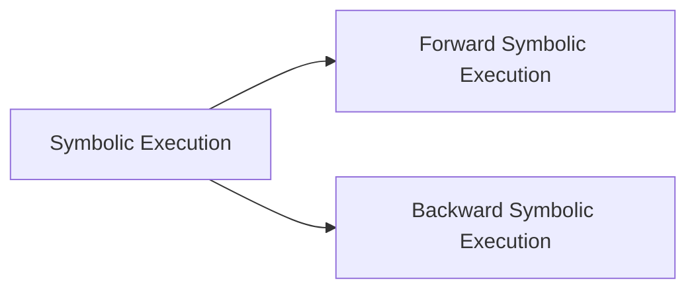

本文详细介绍了动态污点分析（Dynamic Taint Analysis）和前向符号执行（Forward Symbolic Execution）。
<!--more-->

# Dynamic Taint Analysis
Dynamic Taint Analysis的主要思想是标记（或污点）程序中的数据，并跟踪这些标记在程序执行期间的传播。这样可以帮助识别潜在的安全漏洞，尤其是与数据流相关的问题，例如信息泄露、未经授权的数据修改等。

# Forward Symbolic Execution

Forward Symbolic Execution自动地探索程序的执行路径，以便寻找潜在的错误、漏洞或其他安全问题。该技术的核心思想是以符号形式表示程序的输入，并通过模拟程序执行过程来推导出符号执行路径，从而发现潜在的问题。

