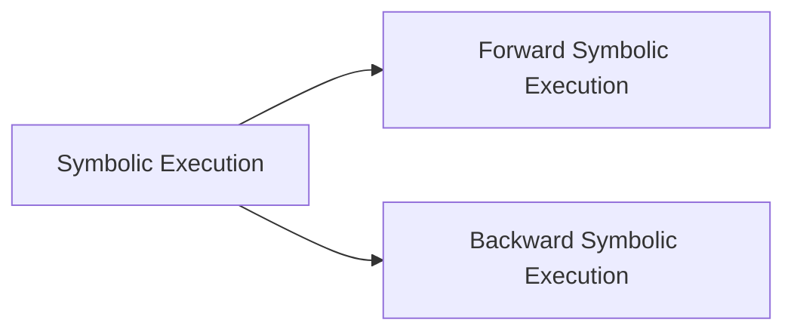

本文详细介绍了动态污点分析（Dynamic Taint Analysis）和前向符号执行（Forward Symbolic Execution）。
<!--more-->

# SIMPIL: A Simple Intermediate Language
{width=500px}

1. **一系列带有编号的语句：**
    SIMPIL中的程序由一系列语句组成，每个语句都被分配一个唯一的编号。
  
2. **语句的类型：**

    SIMPIL中的语句可以是多种类型：
    - **赋值语句：** 包括将值分配给变量的操作。
    - **断言语句：** 表达在程序中某个点上始终应该为真的条件。
    - **跳转语句：** 导致程序跳转到不同语句的语句。
    - **条件跳转语句：** 基于条件而发生跳转的语句。

3. **无副作用的表达式：**
  SIMPIL中的表达式是无副作用的，这意味着它们不会改变程序的状态。副作用通常指的是对变量或其他有状态元素的修改。

1. **二元和一元运算符：**
   - 二元运算符由“ $\lozenge_{b}$ ”表示，其中方框可以填充典型的二元运算符，如加法、减法等。
   - 一元运算符由“ $\lozenge_{u}$ ”表示，表示逻辑取反等一元操作。

2. **输入语句：**
   - 语句 $\mbox{get\_input}(src)$ 用于从指定的源 $src$ 获取输入。

3. **点（$\cdot$）作为被忽略的参数：**
   - 点（$\cdot$）用于表示被忽略的参数。例如，当确切的输入源不相关时，我们会写成 $\mbox{get\_input}(·)$。

4. **32位整数值：**
   - SIMPIL中的表达式被认为求值为32位整数值。通过专注于这种类型，语言和规则保持简单，但描述中提到可以轻松扩展语言和规则以适应其他类型。

## Operational Semantics
{width=400px}

1. **操作语义规则：**
   - SIMPIL语言的操作语义在图1中展示。
   - 每个语句规则的形式为：  
     $$\frac{\mbox{computation}}{\langle \mbox{current state}\rangle, \mbox{stat} \rightsquigarrow \langle\mbox{end state}\rangle, \mbox{stat’} }$$
     这表示从当前状态执行一个在规则中指定的计算，然后转移到一个带有修改语句的终态。

2. **规则应用：**
   - 规则从底部到顶部、从左到右阅读。
   - 给定一条语句，通过模式匹配确定适用的规则。例如，如果语句是赋值语句 $x := e$ ，则匹配到 ASSIGN 规则。
   - 然后应用匹配规则中的计算，如果成功，就转移到终态。
   - 如果没有匹配的规则（或前提中的计算失败），则机器异常终止。

3. **执行上下文：**
   - 由五个参数描述：$\Sigma$（程序语句列表）、$\mu$（当前内存状态）、$\Delta$（当前变量值）、$pc$（程序计数器）和$\iota$（当前语句）。
   - $\Sigma$、$\mu$ 和 $\Delta$ 都起映射的作用。例如，$\Delta[x]$ 表示变量 $x$ 的当前值。
   - 更新上下文变量 $x$ 为值 $v$ 表示为 $x\leftarrow v$。

4. **程序上下文的稳定性：**
   - 在评估规则中，程序上下文 $\Sigma$ 在转换过程中不会改变。
   - 这意味着SIMPIL的操作语义不允许具有动态生成代码的程序。如何支持动态生成代码和其他高级语言特性后面会聊。

5. **表达式的评估规则：**
   - 表达式的评估规则使用类似的符号表示。
   - $\vdash$ 是“推导”或“导出”的符号，表示根据给定的上下文和规则可以推导出某个结论。
   - $\mu, \Delta\vdash e \Downarrow v$ 表示在给定由 $\mu$ 和 $\Delta$ 表示的当前状态中，将表达式 $e$ 评估为值 $v$。对表达式 $e$ 的评估过程包括将 $e$ 与表达式评估规则进行匹配，然后执行规则中附带的计算。
   - 在形式化的语言规范中，通常会定义一组规则，每条规则对应一类表达式结构。评估表达式就是按照这些规则进行匹配和计算。

举个🌰：

{width=400px}

## Special Case Discussion
出于简单的角度考虑，并没有high-level的语言结构，例如函数、作用域等。

解决方案如下：

1. 将缺失的高级语言结构编译为 SIMPIL statements 而非汇编指令。
    - 举例来说，可以将高级代码中的函数调用编译成在SIMPIL中存储返回地址并转移控制流的操作。
      {width=400px}

2. 向SIMPIL添加高级结构。
    - 可以通过向SIMPIL中添加CALL和RET规则来实现对函数的支持。这包括引入新的上下文，如存储返回地址的堆栈上下文（$\lambda$），存储函数局部变量上下文的作用域上下文（$\zeta$）以及从函数名到地址的映射（$\phi$）。
    - 类似地，可以通过重新定义抽象机器转换来支持动态生成的代码。这涉及允许对程序上下文（$\Sigma$）进行更新，并提供将生成的代码添加到 $\Sigma$ 的规则GENCODE。
  
    

# Dynamic Taint Analysis
Dynamic Taint Analysis的主要思想是标记（或污点）程序中的数据，并跟踪这些标记在程序执行期间的传播。这样可以帮助识别潜在的安全漏洞，尤其是与数据流相关的问题，例如信息泄露、未经授权的数据修改等。

# Forward Symbolic Execution

Forward Symbolic Execution自动地探索程序的执行路径，以便寻找潜在的错误、漏洞或其他安全问题。该技术的核心思想是以符号形式表示程序的输入，并通过模拟程序执行过程来推导出符号执行路径，从而发现潜在的问题。

