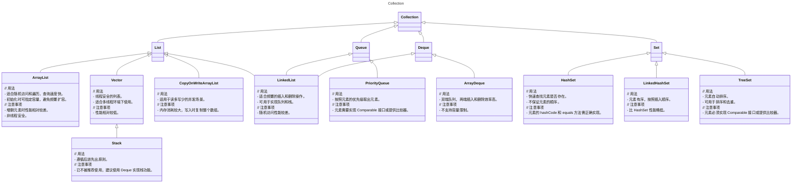
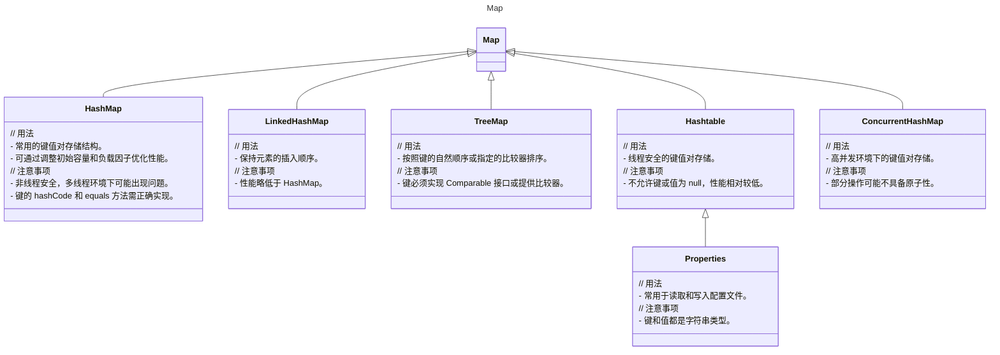

记录一下常用的 LeetCode 刷题技巧（JAVA篇）。
<!--more-->

# 语法
## 字符串操作
### String
在刷 LeetCode 时，Java 的`String`类有以下一些常用操作：

#### 字符串拼接
使用`+`运算符可以方便地将多个字符串拼接在一起。
例如：
```java
String str1 = "Hello";
String str2 = "World";
String result = str1 + " " + str2; 
```

#### 获取字符串长度
通过`length()`方法获取字符串的长度。
```java
String text = "This is a test";
int length = text.length(); 
```

#### 字符提取
可以使用`charAt(int index)`方法获取指定位置的字符。
例如：
```java
String word = "Java";
char ch = word.charAt(2); 
```

#### 子字符串获取
`substring(int beginIndex)`和`substring(int beginIndex, int endIndex)`方法用于获取子字符串。
```java
String sentence = "Hello Java World";
String sub1 = sentence.substring(6); 
String sub2 = sentence.substring(6, 10); 
```

#### 字符串比较
可以使用`equals(Object anObject)`方法比较两个字符串的内容是否相等。
```java
String strA = "apple";
String strB = "apple";
if (strA.equals(strB)) { 
    // 执行相应操作
}
```

#### 字符串转换
例如将字符串转换为字符数组，使用`toCharArray()`方法。
```java
String str = "example";
char[] charArray = str.toCharArray(); 
```

#### 字符串拆分
例如将字符串拆分为字符串数组，使用`split(String regex)`或`split(String regex, int limit)`方法。

- `regex`：要作为分隔符的正则表达式。可以是单个字符、字符序列或更复杂的正则表达式模式。例如，使用`","`来按照逗号进行分割，使用`"\\."`来按照点进行分割（点在正则表达式中有特殊含义，所以需要转义）。
- `limit`（可选参数）：限制分割后子字符串数组的长度。
    - 当`limit`大于 0 时，字符串最多被分隔`limit - 1`次，得到长度为`limit`的数组。如果字符串包含`limit - 1`个分隔符，则从第`limit - 1`个分隔符开始到最后的字符串，将作为一个整体放在数组的最后。
    - 当`limit`等于 0 时，字符串会被尽可能多地分割。
    - 当`limit`小于 0 时，效果与不设置`limit`参数（或`limit`为 0）相同，即字符串也会被尽可能多地分割，不限制数组的长度。

以下是一些示例代码：

```java
public class SplitExample {
    public static void main(String[] args) {
        String str = "welcome-to-runoob";
        System.out.println("- 分隔符返回值:");
        for (String retval : str.split("-")) {
            System.out.println(retval); 
        }

        System.out.println("");
        System.out.println("- 分隔符设置分割份数返回值:");
        for (String retval : str.split("-", 2)) {
            System.out.println(retval); 
        }

        String str2 = "www.runoob.com";
        System.out.println("转义字符返回值:");
        for (String retval : str2.split("\\.")) { 
            System.out.println(retval); 
        }

        String str3 = "acount=?and uu=?or n=?";
        System.out.println("多个分隔符返回值:");
        for (String retval : str3.split("and|or")) { 
            System.out.println(retval); 
        }
    }
}
```

上述代码的输出结果为：

```
- 分隔符返回值:
welcome
to
runoob

- 分隔符设置分割份数返回值:
welcome
to-runoob

转义字符返回值:
www
runoob
com

多个分隔符返回值:
acount=?
uu=?
n=?
```

需要注意的是，某些特殊字符在作为分隔符时需要进行转义，因为它们在正则表达式中有特殊含义，例如`.*+^$|?()[]{}\`等。如果要使用这些字符作为分隔符，需要加上相应的转义字符，如`\\.`表示点，`\\|`表示竖线等。另外，如果分隔符连续出现，可能会产生空字符串作为分割后的子字符串。在实际使用中，要根据具体需求来处理这些情况。


### StringBuilder(非线程安全) & StringBuffer(线程安全)
在刷 LeetCode 时，`StringBuilder`和`StringBuffer`常用于高效地构建和修改字符串。

#### 初始化
```java
StringBuilder sb = new StringBuilder();
StringBuffer sf = new StringBuffer();
```

#### 添加内容
可以使用`append`方法添加各种类型的数据，如字符串、整数、浮点数等。
```java
append(boolean b)
append(char c)
append(char[] str)
append(char[] str, int offset, int len)
append(CharSequence s)
append(CharSequence s, int start, int end)
append(double d)
append(float f)
append(int i)
append(long lng)
append(Object obj)
append(String str)
append(StringBuffer sb)
```

```java
sb.append("Hello");
sb.append(123);
sf.append(3.14);
```

#### 删除部分内容
通过`delete`方法删除指定范围内的字符。
```java
sb.delete(0, 5);  // 删除从索引 0 到 4（包括 4）的字符
```

#### 插入内容
使用`insert`方法在指定位置插入数据。
```java
sb.insert(2, "World");  // 在索引 2 处插入 "World"
```

#### 替换内容
借助`replace`方法替换指定范围内的字符。
```java
sb.replace(1, 3, "Java");  // 替换索引 1 到 2 的字符为 "Java"
```

#### 反转字符串
利用`reverse`方法将字符串反转。
```java
sb.reverse();
```

#### 获取字符串
通过`toString`方法将`StringBuilder`或`StringBuffer`对象转换为`String`类型。
```java
String result = sb.toString();
```

以下是 `StringBuilder` 和 `StringBuffer` 在刷 LeetCode 中可能会用到的一些其他操作：

#### 清空内容
使用 `setLength(0)` 方法可以清空 `StringBuilder` 或 `StringBuffer` 的内容。

#### 获取指定位置的字符
可以使用 `charAt(int index)` 方法获取指定索引位置的字符。

### 设置指定位置的字符
通过 `setCharAt(int index, char ch)` 方法来设置指定索引位置的字符。

#### 获取容量
`capacity()` 方法能获取当前对象的内部字符数组的容量。

#### 获取字符串长度
```java
StringBuilder sb = new StringBuilder("Java");
int length = sb.length();
```
```java
StringBuffer sbuffer = new StringBuffer("Python");
int length = sbuffer.length();
```

#### 截取子字符串
```java
StringBuilder sb = new StringBuilder("HelloWorld");
String sub = sb.substring(5); 
```
```java
StringBuffer sbuffer = new StringBuffer("JavaLanguage");
String sub = sbuffer.substring(4, 8);
```


## Collection






### Deque
**双端队列（Deque）**

双端队列是一种支持在两端进行元素插入和删除的线性集合。“Deque”这个名称是“double ended queue”（双端队列）的缩写，通常发音为“deck”。大多数双端队列的实现对其可能包含的元素数量没有固定限制，但这个接口也支持容量受限的双端队列以及没有固定大小限制的双端队列。

这个接口定义了访问双端队列两端元素的方法。提供了插入、删除和检查元素的方法。每种方法都有两种形式：一种在操作失败时抛出异常，另一种返回一个特殊值（根据操作，可能为 `null` 或 `false`）。插入操作的后一种形式专门用于容量受限的双端队列实现；在大多数实现中，插入操作不会失败。

上述十二种方法总结在以下表格中：

**双端队列方法总结**

|  第一个元素（头部）抛出异常  |  第一个元素（头部）特殊值  |  最后一个元素（尾部）抛出异常  |  最后一个元素（尾部）特殊值  |
| :---: | :---: | :---: | :---: |
| `addFirst(e)`  | `offerFirst(e)`  | `addLast(e)`  | `offerLast(e)`  |
| `removeFirst()`  | `pollFirst()`  | `removeLast()`  | `pollLast()`  |
| `getFirst()`  | `peekFirst()`  | `getLast()`  | `peekLast()`  |

这个接口扩展了 `Queue` 接口。

当双端队列用作队列时，会产生先进先出（FIFO）的行为。元素在双端队列的末尾添加，并从开头移除。从 `Queue` 接口继承的方法与双端队列方法的精确对等关系如下表所示：

**队列和双端队列方法的比较**

|  队列方法  |  等效的双端队列方法  |
| :---: | :---: |
| `add(e)`  | `addLast(e)`  |
| `offer(e)`  | `offerLast(e)`  |
| `remove()`  | `removeFirst()`  |
| `poll()`  | `pollFirst()`  |
| `element()`  | `getFirst()`  |
| `peek()`  | `peekFirst()`  |

双端队列也可以用作后进先出（LIFO）栈。应该优先使用这个接口而不是遗留的 `Stack` 类。当双端队列用作栈时，元素在双端队列的开头进行压入和弹出。栈方法与双端队列方法的精确对等关系如下表所示：

**栈和双端队列方法的比较**

|  栈方法  |  等效的双端队列方法  |
| :---: | :---: |
| `push(e)`  | `addFirst(e)`  |
| `pop()`  | `removeFirst()`  |
| `peek()`  | `peekFirst()`  |

请注意，当双端队列用作队列或栈时，`peek` 方法都能很好地工作；在任何一种情况下，元素都是从双端队列的开头获取的。

这个接口提供了两个方法来删除内部元素，`removeFirstOccurrence` 和 `removeLastOccurrence` 。

与 `List` 接口不同，这个接口不提供对元素的基于索引的访问支持。

虽然双端队列的实现并非严格禁止插入 `null` 元素，但强烈建议不要这样做。任何允许插入 `null` 元素的双端队列实现的用户，都强烈建议不要利用插入 `null` 的能力。这是因为 `null` 被各种方法用作特殊的返回值来表示双端队列为空。

双端队列的实现通常不会定义基于元素的 `equals` 和 `hashCode` 方法，而是从 `Object` 类继承基于标识的版本。

### List
在刷 LeetCode 时，Java 的`List`接口（通常使用`ArrayList`或`LinkedList`实现）有以下一些常用操作：

#### 初始化
```java
List<Integer> list = new ArrayList<>();  // 或者 new LinkedList<>()
```

#### 添加元素
- `add(E element)`：在列表末尾添加元素。
```java
list.add(1);
```
- `add(int index, E element)`：在指定索引位置添加元素。
```java
list.add(1, 2);
```

#### 获取元素
- `get(int index)`：获取指定索引位置的元素。
```java
int element = list.get(0);
```

#### 删除元素
- `remove(int index)`：删除指定索引位置的元素。
```java
list.remove(0);
```
- `remove(Object o)`：删除指定的元素。
```java
list.remove(Integer.valueOf(1));
```

#### 修改元素
- `set(int index, E element)`：将指定索引位置的元素修改为给定元素。
```java
list.set(0, 3);
```

#### 获取列表大小
- `size()`：获取列表中元素的个数。
```java
int size = list.size();
```

#### 判断是否包含元素
- `contains(Object o)`：判断列表是否包含指定元素。
```java
boolean contains = list.contains(2);
```

#### 清空列表
- `clear()`：清空列表中的所有元素。
```java
list.clear();
```

#### 遍历列表
- 使用`for`循环：
```java
for (int i = 0; i < list.size(); i++) {
    int element = list.get(i);
    // 处理元素
}
```
- 使用增强`for`循环：
```java
for (int element : list) {
    // 处理元素
}
```
- 使用迭代器`Iterator`：
```java
Iterator<Integer> iterator = list.iterator();
while (iterator.hasNext()) {
    int element = iterator.next();
    // 处理元素
}
```


### Set
在刷 LeetCode 时，Java 的`Set`接口（常见的实现类如`HashSet`和`TreeSet`）有以下常用操作：

#### 初始化
```java
Set<Integer> set = new HashSet<>();  // 或者 new TreeSet<>()
```

#### 添加元素
```java
set.add(1);
```

#### 判断元素是否存在
```java
boolean exists = set.contains(1);
```

#### 删除元素
```java
set.remove(1);
```

#### 获取集合大小
```java
int size = set.size();
```

#### 清空集合
```java
set.clear();
```

#### 遍历集合
- 使用增强`for`循环：
```java
for (int element : set) {
    // 处理元素
}
```

#### 集合运算
- 求交集：
```java
Set<Integer> set1 = new HashSet<>();
Set<Integer> set2 = new HashSet<>();
// 求交集并存入新的集合
Set<Integer> intersection = new HashSet<>(set1);
intersection.retainAll(set2);
```
- 求并集：
```java
Set<Integer> union = new HashSet<>(set1);
union.addAll(set2);
```
- 求差集：
```java
Set<Integer> difference = new HashSet<>(set1);
difference.removeAll(set2);
```

### Map
在刷 LeetCode 时，Java 的`Map`接口（常见的实现类如`HashMap`和`TreeMap`）有以下常用操作：

#### 初始化
```java
Map<String, Integer> map = new HashMap<>();  // 或者 new TreeMap<>()
```

#### 添加键值对
```java
map.put("key1", 10);
```

#### 获取值
```java
int value = map.get("key1");
```

#### 判断键是否存在
```java
boolean containsKey = map.containsKey("key1");
```

#### 删除键值对
```java
map.remove("key1");
```

#### 获取键集合
```java
Set<String> keys = map.keySet();
```

#### 获取值集合
```java
Collection<Integer> values = map.values();
```

#### 判断是否为空
```java
boolean isEmpty = map.isEmpty();
```

#### 清空
```java
map.clear();
```

#### 遍历
- 通过键遍历：
```java
for (String key : map.keySet()) {
    int value = map.get(key);
    // 处理键值对
}
```
- 通过键值对遍历：
```java
for (Map.Entry<String, Integer> entry : map.entrySet()) {
    String key = entry.getKey();
    int value = entry.getValue();
    // 处理键值对
}
```

# 技巧

## 基础类型转换
在 Java 中，刷 LeetCode 时常用的不同类型之间互相转换的方法有以下几种：

**整数与字符串之间的转换**：
- `Integer.toString(int)` ：将整数转换为字符串。例如：`Integer.toString(123)` 将返回字符串 `"123"` 。
- `Integer.parseInt(String)` ：将字符串转换为整数。例如：`Integer.parseInt("123")` 将返回整数 `123` 。

**字符与整数之间的转换**：
- `(int)char` ：将字符转换为对应的 ASCII 码值。例如：`(int)'A'` 将返回 `65` 。
- `char(int)` ：将整数（代表 ASCII 码值）转换为对应的字符。例如：`char(65)` 将返回字符 `'A'` 。

**浮点数与字符串之间的转换**：
- `Double.toString(double)` ：将双精度浮点数转换为字符串。例如：`Double.toString(3.14)` 。
- `Double.parseDouble(String)` ：将字符串转换为双精度浮点数。例如：`Double.parseDouble("3.14")` 。

**字符串与其他基本数据类型的转换**：
- 除了上述提到的整数和浮点数，对于其他基本数据类型（如 `short` 、 `long` 、 `float` 等），也有相应的 `parseXXX` 和 `toString` 方法进行转换。

## List 和数组之间的相互转换

**数组转 `List`**：

使用 `Arrays.asList()` 方法，但需要注意它返回的 `List` 是不可变的。
```java
int[] arr = {1, 2, 3};
List<Integer> list = Arrays.asList(1, 2, 3);
```

如果要得到一个可变的 `List` ，可以手动遍历数组添加元素到新的 `List` 中。
```java
int[] arr = {1, 2, 3};
List<Integer> list = new ArrayList<>();
for (int num : arr) {
    list.add(num);
}
```

**`List` 转数组**：

使用 `toArray()` 方法。
```java
List<Integer> list = Arrays.asList(1, 2, 3);
Integer[] arr = list.toArray(new Integer[0]);
```

或者指定数组的长度。
```java
List<Integer> list = Arrays.asList(1, 2, 3);
Integer[] arr = list.toArray(new Integer[list.size()]);
```

## String 和 char 数组之间的相互转换

在 Java 中，`String` 和 `char` 数组之间的相互转换有多种方法，以下为您详细介绍：

**`String` 转换为 `char` 数组**：
```java
String str = "Hello";
char[] charArray = str.toCharArray();
```
例如，如果 `str` 的值为 `"World"` ，转换后的 `charArray` 就是 `['W', 'o', 'r', 'l', 'd']` 。

**`char` 数组转换为 `String`**：
```java
char[] charArray = {'H', 'e', 'l', 'l', 'o'};
String str = new String(charArray);
```
再比如，`charArray` 为 `['J', 'a', 'v', 'a']` ，转换得到的 `str` 就是 `"Java"` 。

还可以通过 `StringBuilder` 或 `StringBuffer` 来实现转换：
```java
char[] charArray = {'H', 'e', 'l', 'l', 'o'};
StringBuilder stringBuilder = new StringBuilder();
for (char c : charArray) {
    stringBuilder.append(c);
}
String str = stringBuilder.toString();
```
