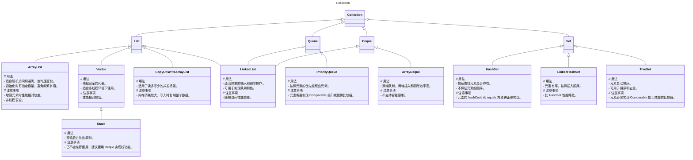

记录一下常用的 LeetCode 刷题技巧。
<!--more-->

# C++


# JAVA

## String
在刷 LeetCode 时，Java 的`String`类有以下一些常用操作：

### 字符串拼接
使用`+`运算符可以方便地将多个字符串拼接在一起。
例如：
```java
String str1 = "Hello";
String str2 = "World";
String result = str1 + " " + str2; 
```

### 获取字符串长度
通过`length()`方法获取字符串的长度。
```java
String text = "This is a test";
int length = text.length(); 
```

### 字符提取
可以使用`charAt(int index)`方法获取指定位置的字符。
例如：
```java
String word = "Java";
char ch = word.charAt(2); 
```

### 子字符串获取
`substring(int beginIndex)`和`substring(int beginIndex, int endIndex)`方法用于获取子字符串。
```java
String sentence = "Hello Java World";
String sub1 = sentence.substring(6); 
String sub2 = sentence.substring(6, 10); 
```

### 字符串比较
可以使用`equals(Object anObject)`方法比较两个字符串的内容是否相等。
```java
String strA = "apple";
String strB = "apple";
if (strA.equals(strB)) { 
    // 执行相应操作
}
```

### 字符串转换
例如将字符串转换为字符数组，使用`toCharArray()`方法。
```java
String str = "example";
char[] charArray = str.toCharArray(); 
```

### 字符串拆分
例如将字符串拆分为字符串数组，使用`split(String regex)`或`split(String regex, int limit)`方法。

- `regex`：要作为分隔符的正则表达式。可以是单个字符、字符序列或更复杂的正则表达式模式。例如，使用`","`来按照逗号进行分割，使用`"\\."`来按照点进行分割（点在正则表达式中有特殊含义，所以需要转义）。
- `limit`（可选参数）：限制分割后子字符串数组的长度。
    - 当`limit`大于 0 时，字符串最多被分隔`limit - 1`次，得到长度为`limit`的数组。如果字符串包含`limit - 1`个分隔符，则从第`limit - 1`个分隔符开始到最后的字符串，将作为一个整体放在数组的最后。
    - 当`limit`等于 0 时，字符串会被尽可能多地分割。
    - 当`limit`小于 0 时，效果与不设置`limit`参数（或`limit`为 0）相同，即字符串也会被尽可能多地分割，不限制数组的长度。

以下是一些示例代码：

```java
public class SplitExample {
    public static void main(String[] args) {
        String str = "welcome-to-runoob";
        System.out.println("- 分隔符返回值:");
        for (String retval : str.split("-")) {
            System.out.println(retval); 
        }

        System.out.println("");
        System.out.println("- 分隔符设置分割份数返回值:");
        for (String retval : str.split("-", 2)) {
            System.out.println(retval); 
        }

        String str2 = "www.runoob.com";
        System.out.println("转义字符返回值:");
        for (String retval : str2.split("\\.")) { 
            System.out.println(retval); 
        }

        String str3 = "acount=?and uu=?or n=?";
        System.out.println("多个分隔符返回值:");
        for (String retval : str3.split("and|or")) { 
            System.out.println(retval); 
        }
    }
}
```

上述代码的输出结果为：

```
- 分隔符返回值:
welcome
to
runoob

- 分隔符设置分割份数返回值:
welcome
to-runoob

转义字符返回值:
www
runoob
com

多个分隔符返回值:
acount=?
uu=?
n=?
```

需要注意的是，某些特殊字符在作为分隔符时需要进行转义，因为它们在正则表达式中有特殊含义，例如`.*+^$|?()[]{}\`等。如果要使用这些字符作为分隔符，需要加上相应的转义字符，如`\\.`表示点，`\\|`表示竖线等。另外，如果分隔符连续出现，可能会产生空字符串作为分割后的子字符串。在实际使用中，要根据具体需求来处理这些情况。

## Collection




